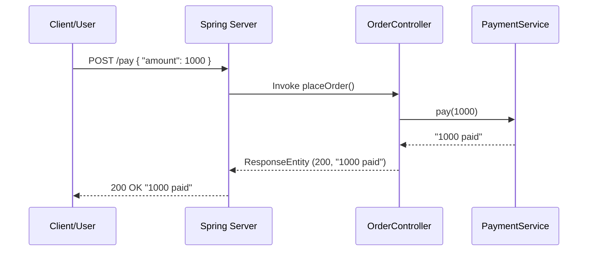

## ResponseEntityの役割について

### 指定されたコードの動作説明:
1. エンドユーザーまたはクライアントが`/pay`エンドポイントへHTTP POSTリクエストを送信します。このリクエストには、支払いに関するデータ（例: 金額）がJSON形式でボディに含まれています。
2. SpringのDispatcherServletは、このリクエストを適切なコントローラメソッド（この場合は`placeOrder`メソッド）にルーティングします。
3. `@RequestBody`アノテーションは、リクエストボディのJSONデータを`OrderRequest`オブジェクトに変換（デシリアライズ）する役割があります。
4. `OrderRequest`から金額を取得し、`paymentService.pay`メソッドを呼び出して支払いを処理します。
5. 支払いサービスは、支払い処理の結果を文字列として返します。
6. この文字列（paymentResponse）は、クライアントにレスポンスとして返されます。`ResponseEntity.ok(paymentResponse)`は、HTTP 200 OKステータスとともにpaymentResponseの内容をレスポンスボディにセットするために使用されます。

### ResponseEntityについて:
`ResponseEntity`は、Spring Web MVCでHTTPレスポンスを構築するためのクラスです。このクラスを使用することで、レスポンスボディ、HTTPステータスコード、ヘッダーなどを設定してレスポンスを送信することができます。

`ResponseEntity.ok(paymentResponse)`は、HTTPステータスコード200 (OK)とともに、paymentResponseの内容をレスポンスボディにセットしてレスポンスを作成します。

### マーメイドによる処理の図:

このシーケンス図は、クライアントからのリクエストの受信からレスポンスの送信までの一連の処理を示しています。